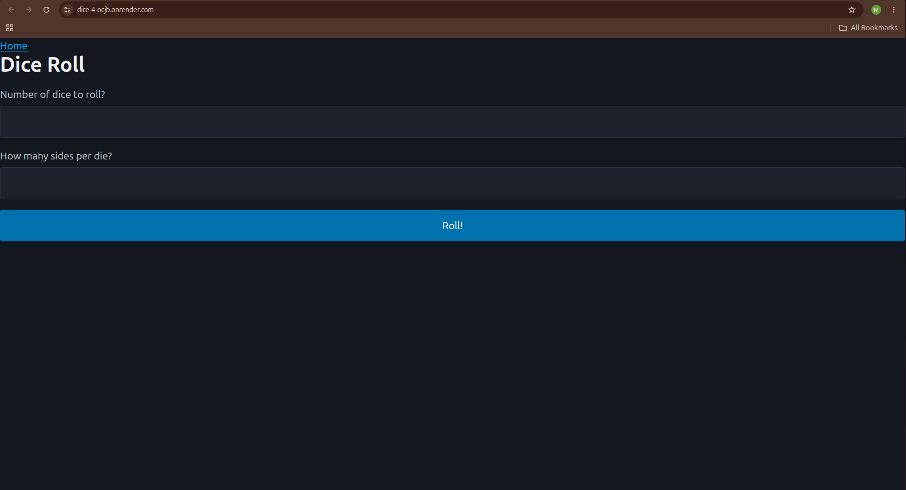

# Dice Roll

Dice Roll is a Ruby on Rails web app that lets users simulate dice rolls by choosing how many dice to roll and how many sides each die should have.

Live Demo: https://dice-4-ocjb.onrender.com

## Features

- Choose the number of dice to roll
- Choose the number of sides per die
- Generate randomized dice results
- Display the results in the browser
- Re-roll with different dice combinations
- Built with Rails routes, controllers, views, and form parameters

## Tech Stack

- Ruby
- Ruby on Rails
- HTML / ERB
- CSS
- JavaScript
- PostgreSQL
- Render

## What I Learned

This project helped me practice building dynamic Rails routes, working with query parameters, handling form input, and using controller actions to generate and display randomized results.

I also practiced preparing a Rails app for production deployment, including configuring environment variables, connecting a PostgreSQL database, and deploying the app with Docker on Render.

## How It Works

1. The user enters the number of dice they want to roll.
2. The user enters how many sides each die should have.
3. The app sends those values through a Rails form.
4. The controller generates random results.
5. The results are displayed back to the user.

## Screenshots

Add screenshots here after uploading them to the repository.

Example:

## Future Improvements

- Improve the visual design
- Add dice animations
- Add input validation
- Add roll history
- Add automated tests
- Make the app fully responsive on mobile devices

## Author

Built by Muhammed Ahmad as part of my Ruby on Rails portfolio.
Some rights reserved — see [LICENSE.txt](LICENSE.txt)
